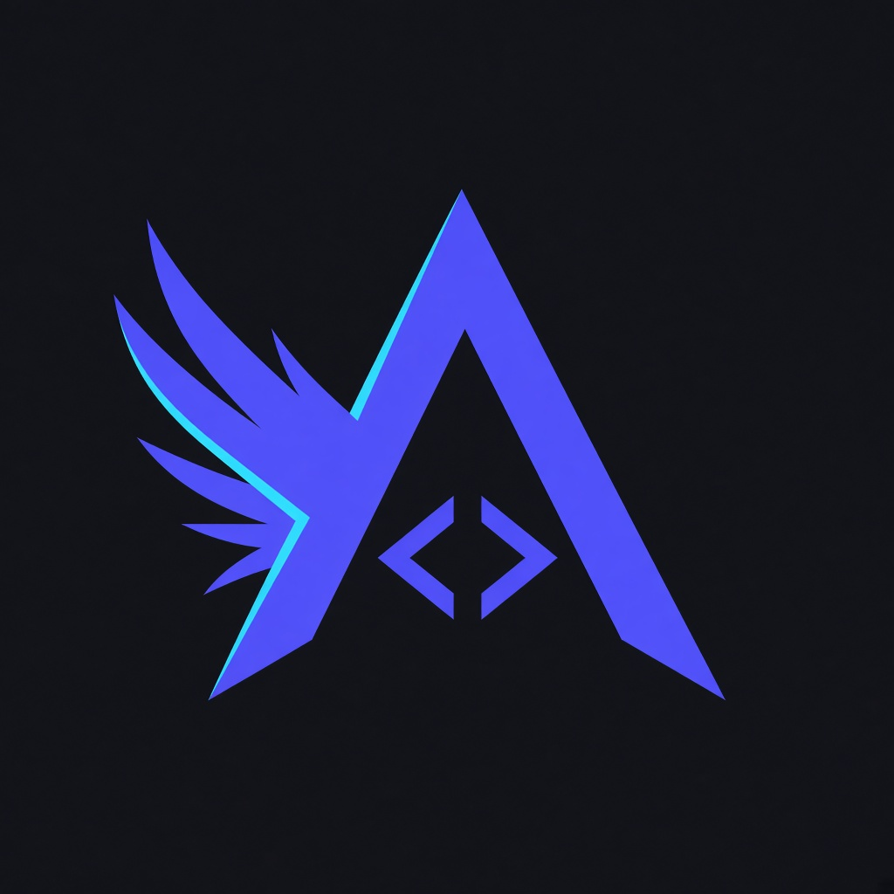
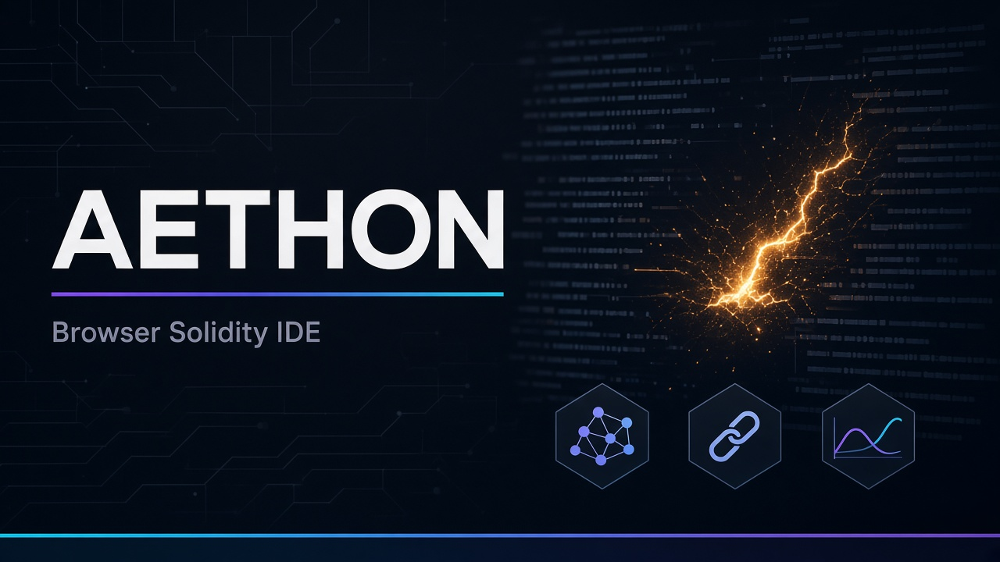
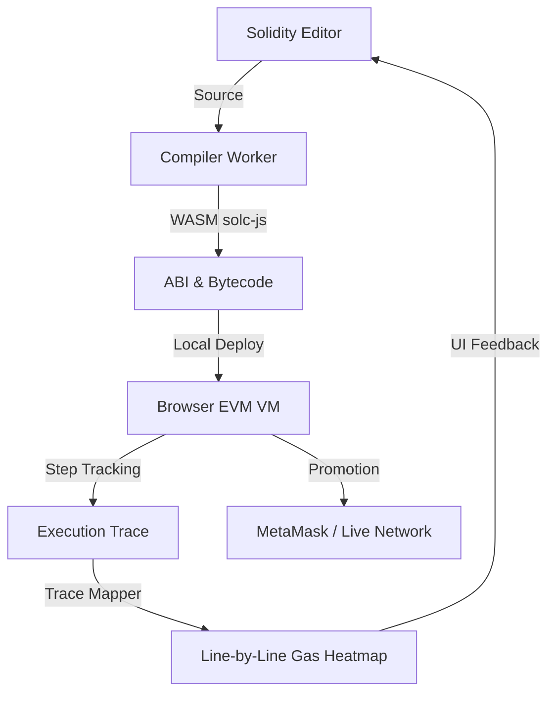

<div align="center">
  
  <h1>Aethon</h1>
  <p><b>Browser-Native Ethereum Lab</b></p>
  <p>
    <a href="https://cryptp-production.up.railway.app/">Live demo</a>
    ·
    <a href="https://twitter.com/assassin_859">
      
    </a>
  </p>
</div>

**Aethon** (repo [Assassin859/cryptp](https://github.com/Assassin859/cryptp)) is a professional-grade Solidity IDE that runs **entirely in the browser** — engineered by **[Maitreya Gaikwad](https://github.com/Assassin859)**. Zero local toolchain: write, compile (WASM), simulate, audit, and deploy.



---

## ETHOnline 2026 Continuity

Track: **Continuity — Extend Open Source**. Partner prizes: **The Graph**, **Chainlink**, **Uniswap Foundation**.

| Partner | Continuity upgrade | Docs |
| :--- | :--- | :--- |
| **The Graph** | Indexed panel + live Sepolia subgraph; audit context in Confidential | [THE_GRAPH.md](docs/THE_GRAPH.md) |
| **Chainlink** | CRE pre-deploy audit gate + ETH/USD Feeds consumer on Sepolia | [CHAINLINK.md](docs/CHAINLINK.md) |
| **Uniswap** | v4 CounterHook template + CREATE2 HookMiner deploy | [UNISWAP.md](docs/UNISWAP.md) · [FEEDBACK.md](FEEDBACK.md) |

Brand kit: [docs/BRAND.md](docs/BRAND.md) · Screenshots: [docs/screenshots/](docs/screenshots/)

---

## Instant Project Awareness

### The Core Loop


### Why Aethon?
- **Hyper-Local Performance**: Compiles Solidity in a background WASM worker.
- **True In-Browser EVM**: `@ethereumjs/vm` for accurate local state.
- **Insight-Driven Profiling**: Line-level gas heatmaps.
- **Studio UX**: AI assistant, security auditor, token factory.
- **The Graph (Indexed)**: On-chain `ValueChanged` history in-IDE. See [docs/THE_GRAPH.md](docs/THE_GRAPH.md).
- **Chainlink CRE + Feeds**: Pre–MetaMask audit gate + onchain ETH/USD settle. See [docs/CHAINLINK.md](docs/CHAINLINK.md).
- **Uniswap v4 hooks**: Educational CounterHook (compile → sandbox → Sepolia). See [docs/UNISWAP.md](docs/UNISWAP.md).

---

## Project Rosetta Stone

| Directory | Purpose | Key File |
| :--- | :--- | :--- |
| **`src/utils/`** | Engine room | `browserVM.ts` |
| **`src/components/`** | IDE UI | `BrandLogo.tsx`, `SolidityEditor.tsx` |
| **`contracts/`** | Continuity contracts | `hooks/CounterHook.sol` |
| **`scripts/`** | Network deploys | `deploy-counter-hook.ts`, `hookMiner.ts` |
| **`cre/`** | Chainlink CRE audit workflow | `aethon-audit-firewall/` |
| **`subgraph/`** | The Graph Sepolia indexer | `subgraph.yaml` |
| **`public/`** | Logo, cover, favicon | `aethon-logo.png` |
| **`docs/`** | Deep-dive docs | `BRAND.md`, partner guides |
| **`FEEDBACK.md`** | Uniswap Foundation feedback | UF prize form |

---

## Internal Architecture

### Compiler Pipeline (`src/utils/compiler.worker.ts`)
WASM solc binaries from the official Solidity CDN — versions 0.4.x–0.8.x without bloating the bundle.

### Virtual Blockchain (`src/utils/browserVM.ts`)
`@ethereumjs/vm` in-browser; workspaces persist via **Supabase** (`userData.ts`).

### Execution Insights (`src/utils/traceMapper.ts`)
Maps VM step PCs to source lines for the **Gas Heatmap**.

---

## Getting Started

1. **Clone & Install**:
   ```bash
   npm install
   ```

2. **Environment** (required):
   Copy `.env.example` to `.env.local` and set `VITE_SUPABASE_URL` and `VITE_SUPABASE_ANON_KEY` from your [Supabase](https://supabase.com/dashboard) project (Settings → API).

   Optional Continuity: `VITE_GRAPH_*`, `VITE_CRE_*`, `VITE_ETH_USD_CONSUMER_ADDRESS` — see partner docs above.

3. **Launch**:
   ```bash
   npm run dev
   ```

---

The built-in security audit uses static AST heuristics for fast feedback. It is not a substitute for Slither, formal verification, or a professional audit before mainnet.

## Tech Stack
- **Frontend**: React 18, TypeScript, Tailwind CSS
- **Editor**: Monaco Editor (`@monaco-editor/react`)
- **Blockchain**: Ethers.js v6, EthereumJS (`@ethereumjs/vm`)
- **Backend/Auth**: Supabase
- **Build**: Vite
- **Continuity**: The Graph, Chainlink CRE + Price Feeds, Uniswap v4 hooks

---

*Built for the DeFi Developer Community · © 2026 Aethon*
