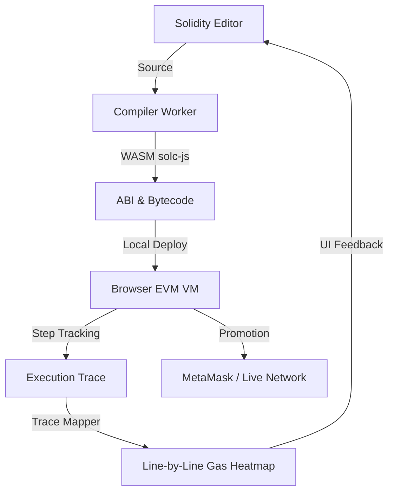

# 🚀 CryptP IDE: The Browser-Native Ethereum Lab

**CryptP IDE** is a high-performance, professional-grade development environment for Solidity smart contracts that runs **entirely in your browser**. It eliminates the need for local toolchains, providing a "Zero-Config" experience for building, compiling, and profiling DeFi protocols and smart contracts.

---

## ⚡ Instant Project Awareness

### The Core Loop


### Why CryptP?
- **Hyper-Local Performance**: Compiles Solidity in a background WASM worker. No more waiting for server-side responses.
- **True In-Browser EVM**: Powered by `@ethereumjs/vm`, ensuring 100% state and math accuracy without a local node.
- **Insight-Driven Profiling**: Visualizes gas consumption line-by-line, allowing you to optimize contracts during development.
- **Studio-Ready UX**: Integrated AI assistant, security auditor, and one-click token factories.

---

## 📂 Project Rosetta Stone

| Directory | Purpose | Key File |
| :--- | :--- | :--- |
| **`src/utils/`** | The "Engine Room" of the IDE. | `browserVM.ts` (The local chain) |
| **`src/components/`** | Modular UI components for the IDE layout. | `SolidityEditor.tsx` (Monaco wrapper) |
| **`contracts/`** | Smart contract templates and local storage. | `Counter.sol` (Example template) |
| **`scripts/`** | Deployment logic for real-world networks. | `deploy.ts` (Hardhat script) |
| **`ignition/`** | Hardhat Ignition deployment modules. | `Counter.ts` |
| **`docs/`** | Deep-dive documentation for users. | `INSTALLATION.md` |

---

## 🛠️ Internal Architecture Deep-Dive

### 📡 The Compiler Pipeline (`src/utils/compiler.worker.ts`)
We bypass heavy NPM dependencies by dynamically loading lightweight **WASM binaries** from the official Solidity binaries server. This ensures version compatibility (0.4.x to 0.8.x) without bloating the frontend bundle.

### ⛓️ The Virtual Blockchain (`src/utils/browserVM.ts`)
Using `@ethereumjs/vm`, we spawn a full blockchain instance in your browser RAM. 
- **Persistence**: Workspaces are saved to **Supabase** via `userData.ts`.
- **Interactivity**: `ContractInteraction.tsx` dynamically generates UIs from your contract's ABI.

### 🔍 Execution Insights (`src/utils/traceMapper.ts`)
During execution, the VM emits "step" events. We map these Program Counters (PC) back to your source code lines using the compiler's source map, creating the **Gas Heatmap**.

---

## 🚀 Getting Started

1. **Clone & Install**:
   ```bash
   npm install
   ```

2. **Environment Setup**:
   Copy `.env.example` to `.env` and add your **Supabase** credentials.

3. **Launch the Engine**:
   ```bash
   npm run dev
   ```

---

## 🧪 Tech Stack
- **Frontend**: React 18, TypeScript, Tailwind CSS
- **Editor**: Monaco Editor (`@monaco-editor/react`)
- **Blockchain**: Ethers.js v6, EthereumJS (`@ethereumjs/vm`, `@ethereumjs/tx`)
- **Backend/Auth**: Supabase
- **Build**: Vite

---

*Built with ❤️ for the DeFi Developer Community.*
